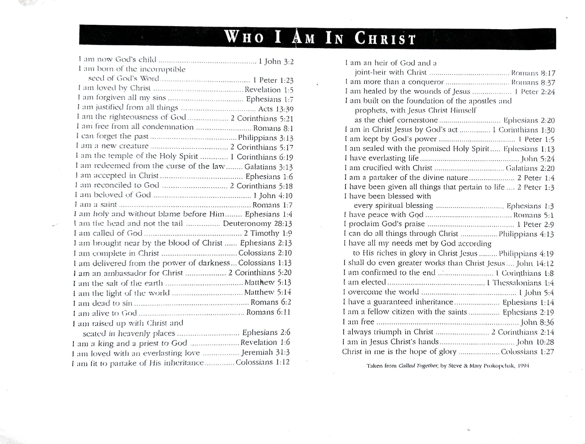

> _"The tongue has the power of life and death, and those who love it will eat its fruit."_  
> — **Proverbs 18:21**

---

## When Conversations Hurt More Than Help

We don’t always mean to do it.

But sometimes our words become weapons —  
Not in obvious attacks, but in quieter ways:

- Gossip disguised as concern  
- Slander wrapped in “just being honest”  
- Stories that were never ours to share  

These moments feel small — but their impact rarely is.

> _“The words of a gossip are like choice morsels; they go down to the inmost parts.”_ — Proverbs 18:8

Words can build.  
Words can also bury.

---

## Without Gossip, the Fire Dies

> _“Without wood a fire goes out; without a gossip a quarrel dies down.”_ — Proverbs 26:20

Gossip feeds conflict.  
It stirs suspicion.  
It makes us feel closer while pushing others out.

But Scripture invites us to **a higher road** —  
One paved not with suspicion, but **affirmation**.

---

## Speaking Life Instead of Fueling Fire

> _“Let no corrupt word proceed out of your mouth, but what is good for necessary edification, that it may impart grace to the hearers.”_ — Ephesians 4:29

Instead of letting our words **stir drama**,  
What if we let them **spark hope**?

Here’s what life-giving speech looks like:

- Encouragement when others feel unseen  
- Reminder of who they are in Christ  
- Honest celebration, even when we’re still waiting

---

## Who I Am in Christ

This week, I’ve been carrying around a sheet titled *“Who I Am in Christ”* — a reminder of truth in a world full of noise.

It lists identity-shaping affirmations from Scripture like:

- *I am accepted in Christ* (Ephesians 1:6)  
- *I am free from all condemnation* (Romans 8:1)  
- *I am chosen, holy, and blameless* (Ephesians 1:4)  
- *I am God's workmanship* (Ephesians 2:10)  
- *I am a new creation* (2 Corinthians 5:17)

You can keep a copy of this as a spiritual anchor — something to speak over yourself daily, or even to encourage a friend in a hard season.

---

## From Fuel to Foundation

If you’ve found yourself slipping into conversations that **fuel the wrong fire**, here’s the redirect:

- Speak Scripture instead of suspicion  
- Declare identity instead of insecurity  
- Uplift others instead of undercutting them  

You don’t have to fight gossip with silence —  
You can fight it with **truth**.

---

## Final Thought

Words have power.  
They shape culture, communities, and people.

> Let yours be the kind that **build**, not burn.  
> Let them be filled with **hope**, not heat.  
> Let them reflect the God who still speaks **life**.

---

*If this helped you, pass it on. Someone in your circle may need words that heal today.*
